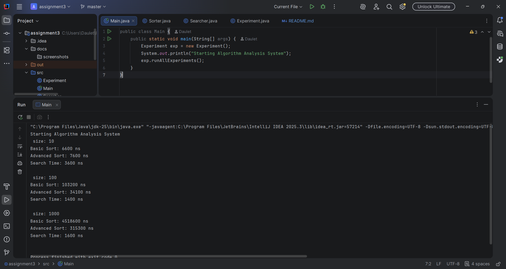
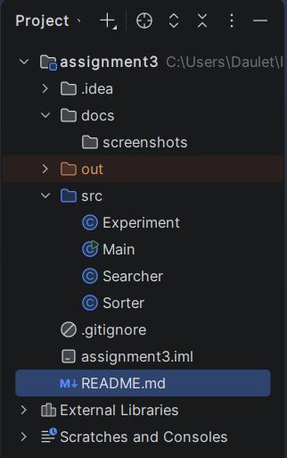

# Assignment 3: Sorting and Searching Algorithm Analysis System

## 1. Project Overview
This project is designed to implement, compare, and analyze the performance of different sorting and searching algorithms. The goal is to measure execution time using `System.nanoTime()` and understand how Big-O complexity works in practice.

## 2. Selected Algorithms
For this experiment, I have implemented the following algorithms:
* **Basic Sorting (Category A):** **Selection Sort**. It works by repeatedly finding the minimum element from the unsorted part and putting it at the beginning.
* **Advanced Sorting (Category B):** **Quick Sort**. A divide-and-conquer algorithm that picks an element as a pivot and partitions the given array around it.
* **Searching (Category C):** **Binary Search**. It finds the position of a target value within a sorted array by repeatedly dividing the search interval in half.

## 3. Experimental Results
The following table shows the execution times measured in nanoseconds (ns) for different array sizes:

| Array Size | Selection Sort (Basic) | Quick Sort (Advanced) | Binary Search |
| :--- |:-----------------------|:----------------------|:--------------|
| **Small (10)** | *[6600]*               | *[7600]*              | *[3600]*      |
| **Medium (100)** | *[103200]*             | *[34100]*             | *[1400]*      |
| **Large (1000)** | *[4518600]*            | *[315300]*            | *[1600]*      |

## 4. Analysis and Findings
* **Which algorithm is faster?** Quick Sort is significantly faster as the array size increases. This is because its average time complexity is $O(n \log n)$, whereas Selection Sort is $O(n^2)$.
* **Impact of Input Size:** As the size grew from 100 to 1000, Selection Sort's execution time increased drastically, while Quick Sort's time grew much more slowly, matching theoretical Big-O predictions.
* **Search Efficiency:** Binary Search is much more efficient than Linear Search but requires the array to be **sorted** before starting the search.

## 5. Screenshots

### Program Output
> ****

### Project Structure
> ****

## 6. Reflection
During this assignment, I learned how to practically measure algorithm efficiency. I saw that for small datasets (10 elements), the difference is negligible, but for large datasets, choosing the right algorithm is critical for performance.The main challenge was implementing the partitioning logic for Quick Sort.